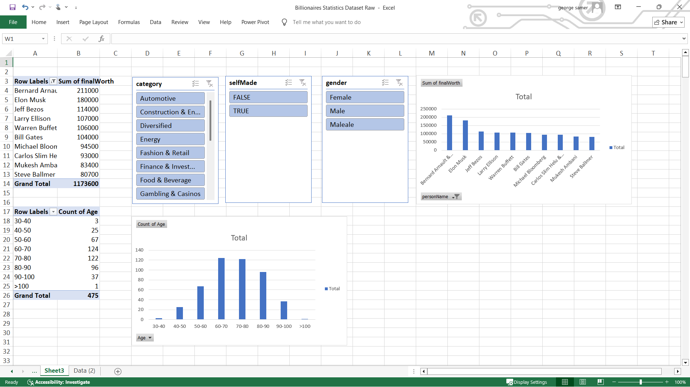

# Billionaires Statistics Excel Analysis

## 📊 Project Overview
This project provides a comprehensive data analysis of global billionaires statistics using Microsoft Excel. By leveraging advanced data manipulation, Pivot Tables, and dynamic charts, the dashboard uncovers key insights regarding global wealth distribution[cite: 1].

## 🛠️ Tools & Techniques
* **Microsoft Excel**
* **Pivot Tables & Pivot Charts**[cite: 1]
* **Data Filtering & Aggregation**
* **Conditional Formatting**

## 📈 Key Insights & Dashboard Features
* **Industry Wealth Breakdown:** Analyzes total net worth across various sectors such as Automotive, Technology, Finance, and Energy[cite: 1].
* **Demographics & Background:** Explores the distribution of wealth concerning self-made status versus inherited wealth, gender[cite: 1], and geographic representation.
* **Age Distribution Analysis:** Categorizes billionaire age groups (ranging from under 30 to over 100) to evaluate peak wealth accumulation periods[cite: 1].
* **Interactive Filtering:** Built-in slicers for categories, self-made status, and gender to allow dynamic data exploration[cite: 1].

## 📷 Dashboard Preview

